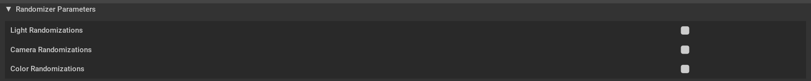
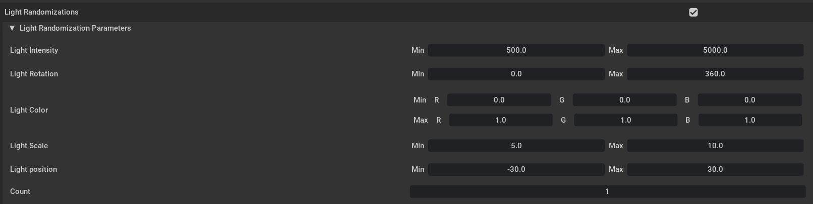
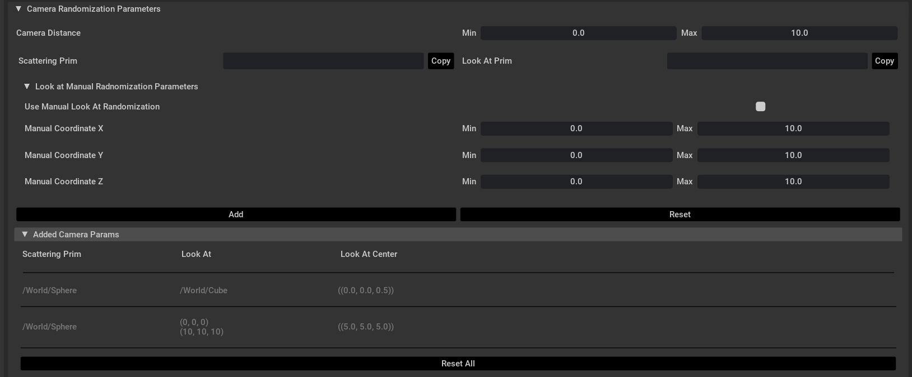
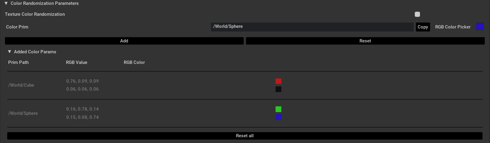
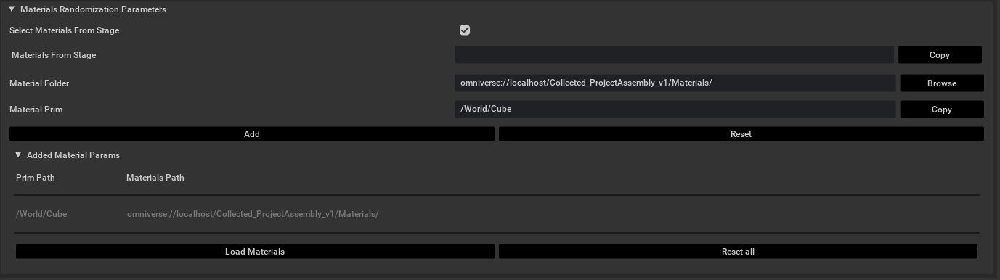

# AI Pipeline Defect Generation Extension

This extension for NVIDIA Omniverse allows users to create defects and apply them to prims within an Isaac Sim simulation environment. The extension also provides the means to generate annotated images with customizable domain randomization effects.

|  |  |
|:----------------------------------------------------------:|:-----------------------------------------------------------------:|


# Getting Started

## Adding the Object Parameters

1. **Copy the Target Prim Path**:
   - Open the extension within NVIDIA Omniverse.
   - Click on the prim(s) to which you wish to apply defects, and then click `Copy`.
   - Click `Apply` to add the necessary primvars to the selected prim(s).


## Adding the Defect Parameters

1. **Import the Directory Containing the Defect Folders**:
   - Click the `Open` button and select the directory. The folder should have the following structure:

```
data_defects/
├── crack/
├── hole/
└── scratch/
```

2. **Customize and Add the Desired Defects**:
   - Click on the dropdown menu for one of the three defect types.
   - Choose the semantic label that the defect will be assigned to in the `Defect Semantic` text box.
   - Customize the ranges of the width,and length (or radius) randomization for the defects by entering values in the `Min` and `Max` text boxes.
   - Customize the ranges of rotation randomization, affecting the `X-axis` in normal mode, and the `X, Y, Z axes` when the `Use Advanced Rotations` checkbox is ticked.
   - Determine the number of instances for this specific defect configuration by entering a value in the `Count` text box.
   - Click on the `+` sign to add the configured defect to the list.
   - The defect information will be indexed by the assigned semantic label.


3. **Import and Export Defect Configuration**:
   - The added defects will appear under the corresponding prim path in the `Params` section.
   - Click the `Load` button next to a defect object entry to load a defect configuration `JSON` file into the object entry.
   - Click the `Select` button next to a defect object entry to make the selected object the current target prim for defect additions.
   - Click the `Export` button next to a defect object entry to save the defect configuration of that object into a `JSON` file.
   - Click the `Garbage Can` icon in the top right corner of a defect object entry to remove the object from the `Params` list.
   - Click the `Garbage Can` button to right the of a defect entry within a defect object to remove that entry from the object's params.


## Adding Randomizer Parameters
- To activate a specific type of randomization tick the checkbox next to the desired randomization type, these include `Light, Camera, Color/Texture` randomizations.


1. **Light Randomizations**:

   - Click on the `Light Randomization Parameters` drop down to show/hide the light randomization UI.
   - Customize the light intensity, and rotation randomization ranges by changing the `Min` and `Max` text boxes next to the `Light Intensity` and `Light Rotation` labels.
   - Modify the RGB color randomization ranges by altering the `Min` and `Max` rows containing a text box for the `R, G, B` channels separately (Note that the ranges are normalized between [0,1]).
   - Alter the light scale, and position by changing the `Min` and `Max` text boxes next to the `Light Scale` and `Light Position` labels.
   - Specify the number of lights present in the scene by inputting that number in the `Count` text box.



2. **Camera Randomizations**:
   * Click on the `Camera Randomization Parameters` drop down to show/hide the camera randomization UI.
   * Choose the distance range that the camera will maintain by changing the `Min` and `Max` text boxes next to the `Camera Distance` label (Note that this distance applies only when a `Scattering Prim` is not specified).
   * Choose a combination of scattering and look at prims by selecting prims from the scene, and pressing the `Copy` button next to the `Scattering Prim` and `Look At Prim` labels, then finally pressing the `Add` button (Note that the scattering prim and look at prim need to be different).
   * Press the `Reset` button to remove the copied scattering and look at prims.
   * Designate a range of coordinates for the camera to look at instead of a prim by ticking the checkbox next to the `Use Manual Look At Randomization` then changing the `Min` and `Max` textboxes next to the `X,Y,Z` labels.
   * Use the `Reset All` button to delete all camera randomization entries after adding at least one entry.
   * Each combination of scattering and look at prim is handled by the extension uniquely, the following is a breakdown of each combination:
     * When a `Scattering Prim` and `Look At Prim` are both chosen from the scene using the `Copy` buttons, a camera will be created and randomly scattered on the surface of the scattering prim, while looking at a random point on the look-at prim.
     * When a `Scattering Prim` is chosen using the `Copy` button but the user chooses to insert a manual look at range using the `Use Manual Look At Randomization` checkbox, a camera will be created and scattered randomly on the surface of the scattering prim while looking at a random point within the range of look at specified.
     * When a `Scattering Prim` is chosen using the `Copy` button but the `Look At Prim` is left empty a camera will be created for every object containing a defect in the scene, these cameras will scatter on the surface of the scattering prim while looking at a random point on their designated look at prim.
     * When a `Look At Prim` is chosen using the `Copy` button but the `Scattering Prim` is left empty a camera will be created and scattered inside the volume of a sphere centered on the `Look At Prim`. The camera will then look at a random point on that `Look At Prim`.
     * When a look at range is specified using the `Use Manual Look At Randomization` option but the `Scattering Prim` is left empty a camera is created and scattered inside the volume of a sphere centered on the specified look-at range. The camera will then focus on a random point within that range. 
     * When both the `Scattering Prim` and `Look At Prim` are left empty, a camera will be created for every object containing a defect in the scene. These cameras will be scattered within the volume of spheres centered on the defect objects, while focusing on a random point on each object.
     


3. **Color Randomizations**:
   * Click on the `Color Randomization Parameters` drop down to show/hide the color randomization UI.
   * Apply the color randomization to the textures of the specified prims by ticking the checkbox next to the `Texture Color Randomization`.
   * Specify the prim for which you want to set the color randomization parameters by selecting the prim and pressing the `Copy` button next to the `Color Prim` label.
   * While the prim is still selected, continuously add colors to the randomization pool by using the `RGB Color Picker` and pressing the `Add` button.
   * Press the `Reset` button to empty the `Color Prim` textbox.
   * Press the `Reset All` button to delete all color randomization entries after adding at least one entry.
   

4. **Material Randomizations**: 
   * Click on the `Material Randomization Parameters` drop down to show/hide the material randomization UI. 
   * Select the prim for which you want to apply material randomizations to in the stage, and press the `Copy` button next to `Material Prim` in the UI. 
   * To select the materials you want to randomize, there are two options that can be used either separately or together: 
      - To use materials already found in the stage, check the `Select From Stage` checkbox. A new section called `Materials from stage` will appear, where you can select the materials from the stage and press the `Copy` button. 
      - To Browse for materials in your nucleus or local directories, simply click the `Browse` button next to `Material Folder` and select the material folder of your choice. 
   * After selecting the material folder and material prim to apply the randomization on, click the `Add`Button. A UI with the selected Prim Paths and Material folder Paths will appear. 
   * To remove a material folder for a specific prim, click the `Reset` button. 
   * To remove all material folders for all prims, click the `Reset All` button.
   * Finally, click the `Load Materials` button to load all the selected materials in the stage, and create those that are not in the stage. 

**Note**: Material randomization and color randomization can be applied together, meaning the color of the newly selected materials will be randomized as well. To do this, make sure you select `Texture Color Randomization` in the Color Randomization Parameters, and add the colors for the prim you would like to have the randomizations on. It is important to note that randomizing the colors of these materials is done by searching through a list of common color attributes found in *color_attributes.json* in *exts/defect.generation/defect/generation/utils/color_attributes.json*, and applying the selected colors to the found attributes. 


* ## Adding the Replicator Parameters

1. **Import the Output Directory**:
   - Click the `Open` button and select the directory where you wish the captured images to be written.

2. **Choose the Writer and Annotations**:
   - Select the `BMW Format` checkbox if you want the output in the BMW JSON format.
   - Select the `Segmentation` checkbox if you want your output to include semantic segmentations.
   - Select the `Bounding Box` checkbox if you want your output to include 2D bounding box annotations.
   - The output directory will contain a `RenderProduct` folder for each camera capturing within the scene (in case of multiple cameras), as follows:

```
output_directory/
├── RenderProduct_Replicator_1/
│   ├── images/
│   ├── labels/
│   └── semantic_segmentation/
├── RenderProduct_Replicator_2/
│   ├── images/
│   ├── labels/
│   └── semantic_segmentation/
├── RenderProduct_Replicator_3/
│   ├── images/
│   ├── labels/
│   └── semantic_segmentation/
└── ...


```
In case there is only one camera in the scene, the output directory will look as follows:

```
output_directory/
├── images/
├── labels/
├── semantic_segmentation/
```


3. **Select the Replicator Frame and Subframe Count**:
   - Enter the number of rendered subframes in the `Render Subframe Count` textbox; to guarantee proper rendering of defects, this value should be between 50 and 100.
   - Enter the number of images you want to capture from the scene in the `frame(s)` textbox.

4. **Build the Defect Layer and Run the Scene**:
   - Click the `Create Replicator Layer` button to create the replicator xform with all the configured defects.
   - Click the `Preview` button to test your scene and the domain randomization.
   - Click the `Run for` button to execute the replicator for the number of frames set, which will start capturing images and randomizing the scene and defects.
   - Click the `Delete Replicator Layer` button to remove the `Replicator` xform, the `/World/Looks` xform, and every `Projection` xform created in all defect objects.


# Authors

- Angelo Yaghi, [BMW TechOffice](), Munich, Germany
- Joe Khalil, [BMW TechOffice](), Munich, Germany
##
- Abboud Hayek, [inmind.ai](https://inmind.ai/), Beirut, Lebanon
- Charbel Bou Maroun, [inmind.ai](https://inmind.ai/), Beirut, Lebanon
- Rachelle Abdel Masih, [inmind.ai](https://inmind.ai/), Beirut, Lebanon
