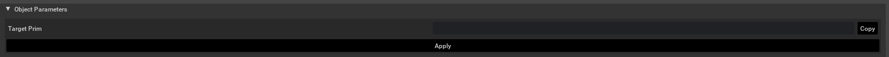
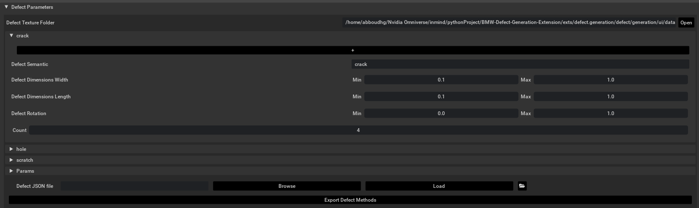
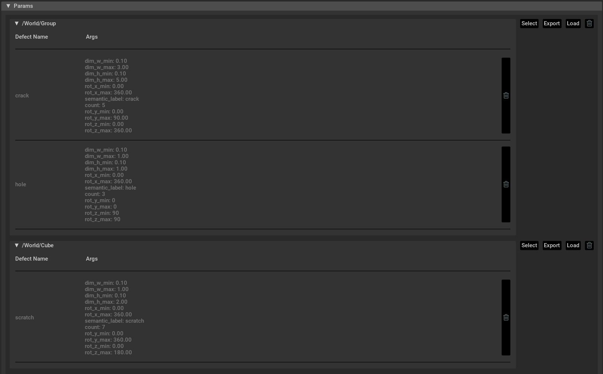
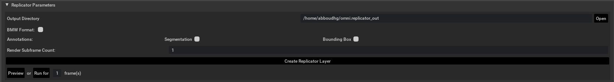

# AI Pipeline Defect Generation Extension

This extension for NVIDIA Omniverse allows users to create defects and apply them onto prims within an Isaac Sim simulation environment. The extension also provides the means to generate annotated images with customizable domain randomization effects.

# Getting Started

## Adding the Object Parameters

1. **Copy the Target PrimPath**:
   - Open the extension within NVIDIA Omniverse.
   - Click on the prim(s) to which you wish to apply defects, and then click `Copy`.
   - Click `Apply` to add the necessary primvars to the prim(s) selected.



## Adding the Defect Parameters

1. **Import the Directory Containing the Defect Folders**:
   - Click the `Open` button and select the directory. The folder should have the following structure:

```
data_defects/
├── crack/
├── hole/
└── scratch/
```

2. **Customize and Add the Desired Defects**:
   - Click on the dropdown menu for one of the three defect types.
   - Choose the semantic label that the defect will be assigned to in the `Defect Semantic` text box.
   - Customize the ranges of the width, length, and rotation randomization for the defects by entering values in the `Min` and `Max` text boxes.
   - Determine the number of instances for this specific defect configuration by entering a value in the `Count` text box.
   - Click on the `+` sign to add the configured defect to the list.
   - The defect information will be indexed by the assigned semantic label.

3. **Import and Export Defect Configuration**:
   - Click the `Export Defect Methods` button to export a JSON file containing all the created defect configurations.
   - To import a JSON file with a prepared defect configuration, click the `Browse` and `Load` buttons.



- The added defects will appear under the corresponding prim path in the `Params` section.

## Adding the Replicator Parameters

1. **Import the Output Directory**:
   - Click the `Open` button and select the directory where you wish the captured images to be written.

2. **Choose the Writer and Annotations**:
   - Select the `BMW Format` checkbox if you want the output in the BMW JSON format.
   - Select the `Segmentation` checkbox if you want your output to include semantic segmentations.
   - Select the `Bounding Box` checkbox if you want your output to include 2D bounding box annotations.
   - The output directory will have the following folders written to it:

```
output_directory/
├── images/
├── labels/
├── semantic_segmentation/

```


3. **Select the Replicator Frame and Subframe Count**:
   - Enter the number of rendered subframes in the `Render Subframe Count` textbox; to guarantee proper rendering of defects, this value should be between 50 and 100.
   - Enter the number of images you want to capture from the scene in the `frame(s)` textbox.

4. **Build the Defect Layer and Run the Scene**:
   - Click the `Create Replicator Layer` button to create the replicator xform with all the configured defects.
   - Click the `Preview` button to test your scene and the domain randomization.
   - Click the `Run for` button to execute the replicator for the number of frames set, which will start capturing images and randomizing the scene and defects.



# Authors

- Angelo Yaghi, [BMW TechOffice](), Munich, Germany
- Joe Khalil, [BMW TechOffice](), Munich, Germany
##
- Abboud Hayek, [inmind.ai](https://inmind.ai/), Beirut, Lebanon
- Charbel Bou Maroun, [inmind.ai](https://inmind.ai/), Beirut, Lebanon
- Rachelle Abdel Masih, [inmind.ai](https://inmind.ai/), Beirut, Lebanon
